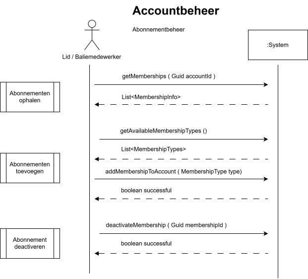
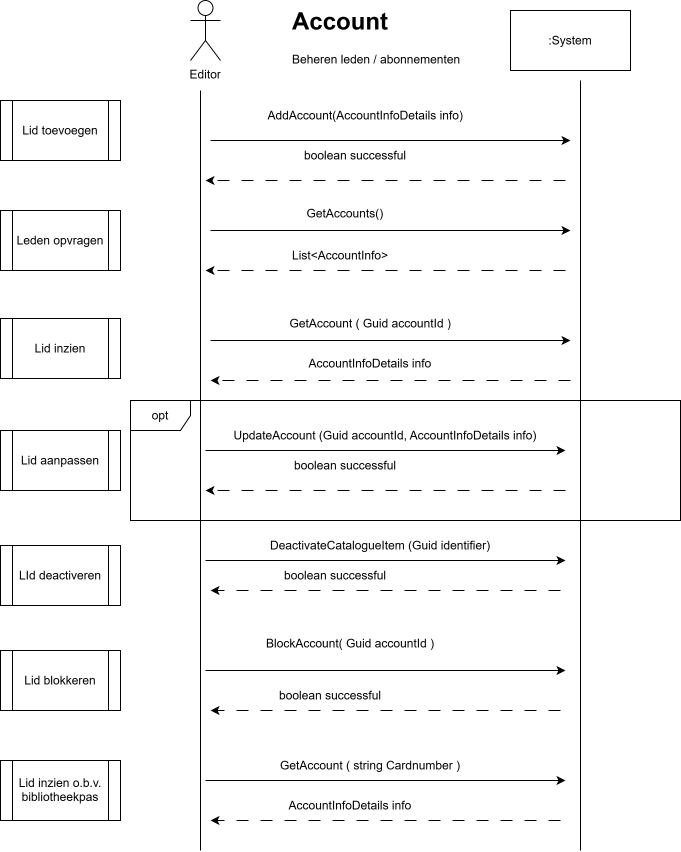

# Abonnement Aanschaffen
<table>
    <thead>
        <tr>
            <th scope="col" colspan="2">Section</th>
        </tr>
    </thead>
    <tbody>
        <tr>
            <th scope="row">Primary Actor</th>
            <td>Lid</td>
        </tr>
        <tr>
            <th scope="row">Stakeholders and Interests</th>
            <td>Beheerder, Baliemedewerker</td>
        </tr>
        <tr>
            <th scope="row">Cross References</th>
            <td>Requirement FR-003</td>
        </tr>
        <tr>
            <th scope="row">Brief Description</th>
            <td>Als lid wil ik een abonnement kunnen aanschaffen via het systeem.</td>
        </tr>
        <tr>
            <th scope="row">Preconditions</th>
            <td>
                1. Het lid is geautoriseerd.
            </td>
        </tr>
        <tr>
            <th scope="row">Postconditions on Success</th>
            <td>1. Het abonnement is gekoppeld aan het lidmaatschap.</td>
        </tr>
        <tr>
            <th scope="row">Postconditions on Failure</th>
            <td></td>
        </tr>
        <tr>
            <th scope="row">Main Success Scenario (Basic Flow)</th>
            <td>
                <table>
                    <thead>
                        <tr>
                            <th scope="col">User</th>
                            <th scope="col">System</th>
                        </tr>
                    </thead>
                    <tbody>
                        <tr>
                            <td>
                                1. Lid verzoekt een abonnement aan te schaffen. 
                                2. Lid vraagt lijst met abonnementstypes op. 
                            </td>
                            <td>
                                3. Systeem toont een lijst met abonnementstypes. 
                            </td>
                        </tr>
                        <tr>
                            <td>
                                4. Lid kiest abonnementstype en bevestigt. 
                            </td>
                            <td>
                                5. Systeem valideert dat abonnementstype gekoppeld mag worden aan account. 
                                6. Systeem koppelt terug dat abonnementstype toegevoegd is.
                            </td>
                        </tr>
                    </tbody>
                </table>
            </td>
        </tr>
        <tr>
            <th scope="row">Alternate Flow</th>
            <td>
                
Foutieve persoonsgegevens en/of abonnementstype

                <table>
                    <thead>
                        <tr>
                            <th scope="col">User</th>
                            <th scope="col">System</th>
                        </tr>
                    </thead>
                    <tbody> 
                        <tr>
                            <td></td>
                            <td>
                                5.A Systeem stelt foutief abonnementstype vast.  
                                6.A Systeem communiceert fout. 
                                <em>terug naar stap 4 </em>
                            </td>
                        </tr>
                    </tbody>
                </table> 
            </td>
        </tr>
        <tr>
            <th scope="row">Exceptional Flows</th>
            <td>
                
Abonnement kon niet worden toegevoegd

                <table>
                    <thead>
                        <tr>
                            <th scope="col">User</th>
                            <th scope="col">System</th>
                        </tr>
                    </thead>
                    <tbody> 
                        <tr>
                            <td></td>
                            <td>
                                5.B Systeem kan gekozen abonnement niet toevoegen aan account. 
                                6.B Systeem toont foutmelding  
                            </td>
                        </tr>
                    </tbody>
                </table> 
            </td>
        </tr>
    </tbody>
</table>

 
 
