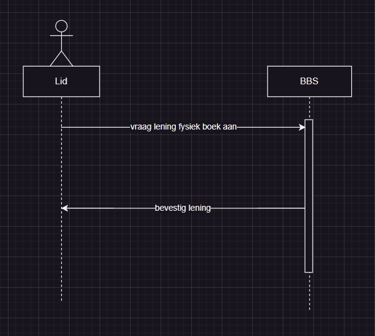
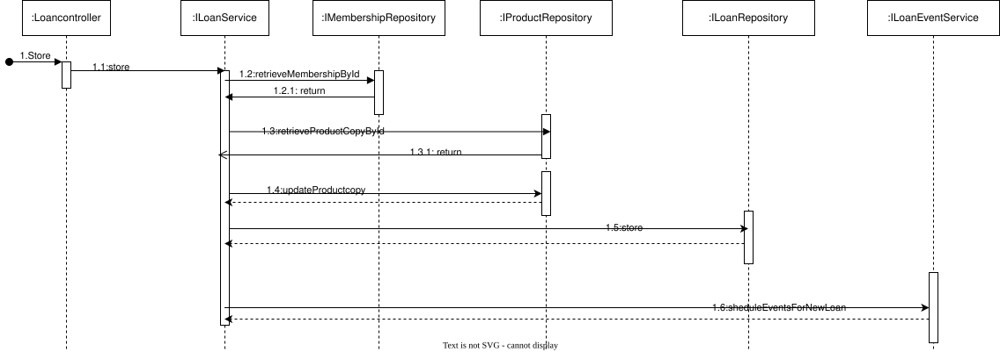

# Fysiek Product Lenen

<table>
    <thead>
        <tr>
            <th><strong>Section</strong></th>
            <th><strong>Details</strong></th>
        </tr>
    </thead>
    <tbody>
        <tr>
            <td><strong>Primary Actor</strong></td>
            <td>Lid</td>
        </tr>
        <tr>
            <td><strong>Stakeholders and Interests</strong></td>
            <td></td>
        </tr>
        <tr>
            <td><strong>Cross References</strong></td>
            <td>Requirement FR-0xx</td>
        </tr>
        <tr>
            <td><strong>Brief Description</strong></td>
            <td>Als lid wil ik een fysiek product kunnen lenen.</td>
        </tr>
        <tr>
            <td><strong>Preconditions</strong></td>
            <td>1. Lid is geautoriseerd.</td>
        </tr>
        <tr>
            <td><strong>Postconditions on Success</strong></td>
            <td>
                1. De bezoeker heeft het product kunnen registreren als geleend. 
                2. Het aantal beschikbare exemplaren van het product ter lening is verminderd. 
                </td>
        </tr>
        <tr>
            <td><strong>Postconditions on Failure</strong></td>
            <td></td>
        </tr>
        <tr>
            <td><strong>Main Success Scenario (Basic Flow)</strong></td>
            <td>
                <table>
                    <thead>
                        <tr>
                            <th scope="col">User</th>
                            <th scope="col">System</th>
                        </tr>
                    </thead>
                    <tbody>
                        <tr>
                            <td>
                                1. Lid verzoekt product te lenen. 
                                2. Lid bevestigt keuze. 
                            </td>
                            <td>
                                3. Systeem controleert of het product beschikbaar is. 
                                4. Systeem controleert of de gebruiker niet geblokkeerd is. 
                                5. Systeem controleert of de gebruiker niet over de algehele leenlimiet gaat. 
                                6. Systeem controleert of de gebruiker niet over de leenlimiet voor het genre gaat. 
                                7. Systeem plant een notificatie in mbt aflopen lening. 
                                8. Systeem koppelt terug dat lening succesvol is.
                            </td>
                        </tr>
                    </tbody>
                </table>
            </td>
        </tr>
        <tr>
            <td><strong>Alternate Flows</strong></td>
            <td>   <table>
                    <thead>
                        <tr>
                            <th scope="col">User</th>
                            <th scope="col">System</th>
                        </tr>
                    </thead>
                    <tbody> 
                        <tr>
                            <td></td>
                            <td>3.A Validatie gefaald. Product niet beschikbaar.</td>
                        </tr>
                        <tr>
                            <td></td>
                            <td>4.A Validatie gefaald. Gebruiker geblokkeerd</td>
                        </tr>
                        <tr>
                            <td></td>
                            <td>5.A Validatie gefaald. Gebruiker gaat over algehele leenlimiet.</td>
                        </tr>
                        <tr>
                            <td></td>
                            <td>6.A Validatie gefaald. Gebruiker gaat over genre-leenlimiet.</td>
                        </tr>
                        <tr>
                            <td></td>
                            <td>6.B Er is geen limiet voor dit genre. Check slaagt.</td>
                        </tr>
                    </tbody>
                </table></td>
        </tr>
    </tbody>
</table>

 
 

