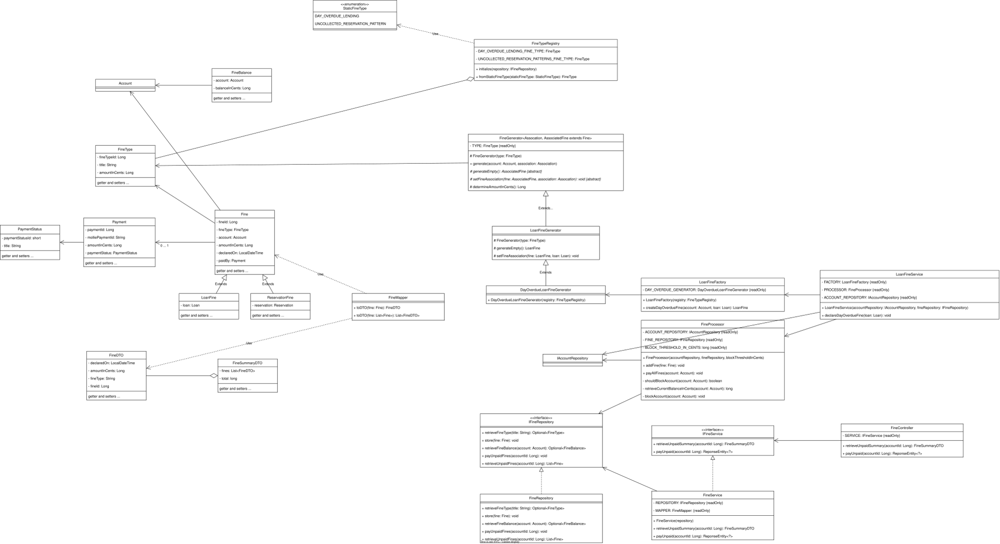

# Fines Design Patterns

## Template Method Pattern
### Waar?
`FineGenerator` i.v.m. `LoanFineGenerator`

### Waarom?
Deze techniek voorkomt gedupliceerde code door statisch een strategie te kiezen met behulp van een subklasse. Zo kan het
_grotere_ algoritme in de superklasse uitgevoerd waarbij een subklasse specifieke stappen in het algoritme kan beïnvloeden.
In dit voorbeeld geldt dat dan voor de methode `generateEmpty()` en `setFineAssociation()`.

## Facade
### Waar?
`LoanFineService`

### Waarom?
Het creëert een nieuwe interface om met alle boete subsystemen te communiceren, zonder alle details te weten. Zo
hoeven buitenstaanders van deze module vooral naar deze _service_ kijken om te weten hoe ze op de notificatie module
kunnen aansluiten. Zo kan er effectief en efficiënt bekende workflows uitgevoerd worden zonder de gehele complexiteit
van de subsystemen in detail in je hoofd te houden.