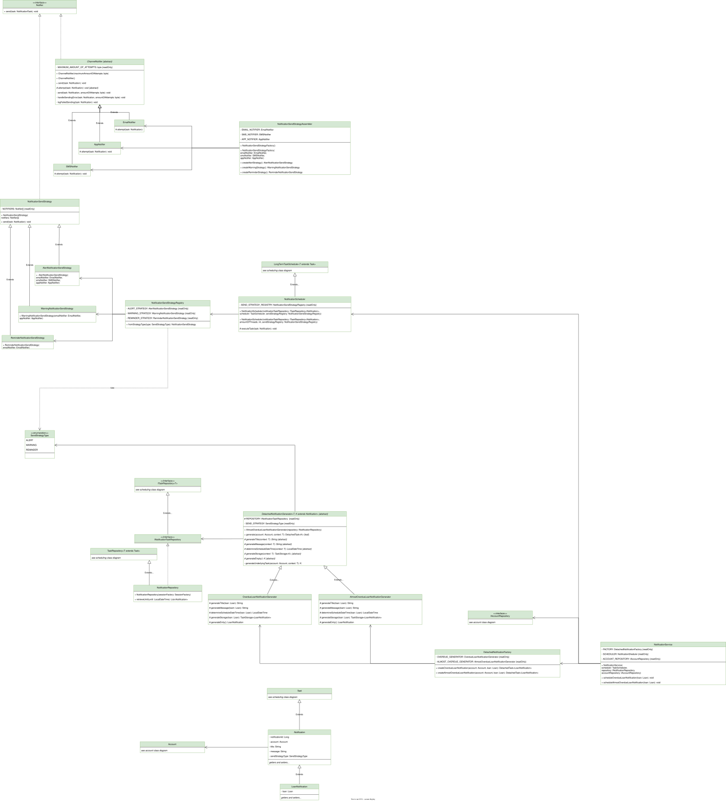

# Notificaties Design Patterns

## Template Method Pattern
### Waar?
`ChannelNotifier` i.v.m. `EmailNotifier`, `AppNotifier` en `SMSNotifier`.

### Waarom?
Deze techniek voorkomt gedupliceerde code door statisch een strategie te kiezen met behulp van een subklasse. Zo kan het
_grotere_ algoritme in de superklasse uitgevoerd waarbij een subklasse specifieke stappen in het algoritme kan beïnvloeden.
In dit voorbeeld geldt dat dan voor de methode `attempt()`.

## Composite Pattern
### Waar?
`NotificationSendStrategy` i.v.m. `Notifier`. [^1]

[^1]: `SendStrategy` was wellicht niet de meest duidelijke naam geweest, i.v.m. de _strategy_ pattern.

### Waarom?
Een `NotificationSendStrategy` kan gebruikt worden als `Notifier`. Er zijn momenteel drie strategieën die verschillende
`Notifier`'s gebruiken. Op deze manier kan je gemakkelijker een verstuurstrategie opmaken. In de praktijk zijn dit een 
serie implementaties van de `ChannelNotifier`, dus over welke channels ga je notificatie sturen. We hoeven nu enkel op
die strategie het gedrag te vragen en die zal het vervolgens deligeren naar al die channels.

## Template Method Pattern
### Waar?
`NotificationScheduler` i.v.m. `LongTermScheduler`.

Zie _scheduling_ design patterns.

## Template Method Pattern
### Waar?
`DetachedNotificationGenerator` i.v.m. `OverdueLoanNotificationGenerator` en `AlmostOverdueLoanNotificationGenerator`.

### Waarom?
Deze techniek voorkomt gedupliceerde code door statisch een strategie te kiezen met behulp van een subklasse. Zo kan het
_grotere_ algoritme in de superklasse uitgevoerd waarbij een subklasse specifieke stappen in het algoritme kan beïnvloeden.
In dit voorbeeld geldt dat dan voor de methodes: 
- `generateTitle()`
- `generateMessage()`
- `generateScheduleDateTime()`
- `generateStorage()`
- `generateEmpty()`

## Facade Pattern
### Waar?
`NotificationService`

### Waarom?
Het creëert een nieuwe interface om met alle notificatie subsystemen te communiceren, zonder alle details te weten. Zo
hoeven buitenstaanders van deze module vooral naar deze _service_ kijken om te weten hoe ze op de notificatie module 
kunnen aansluiten. Zo kan er effectief en efficiënt bekende workflows uitgevoerd worden zonder de gehele complexiteit
van de subsystemen in detail in je hoofd te houden.