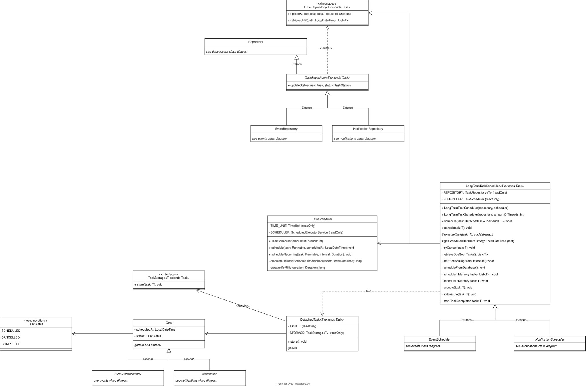
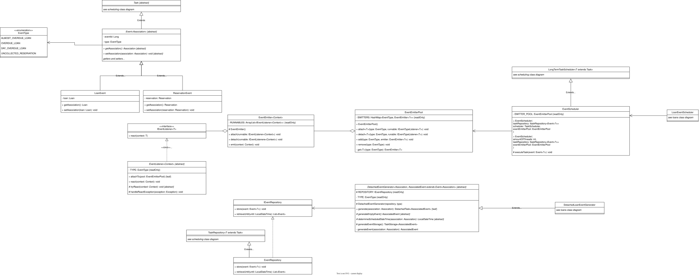
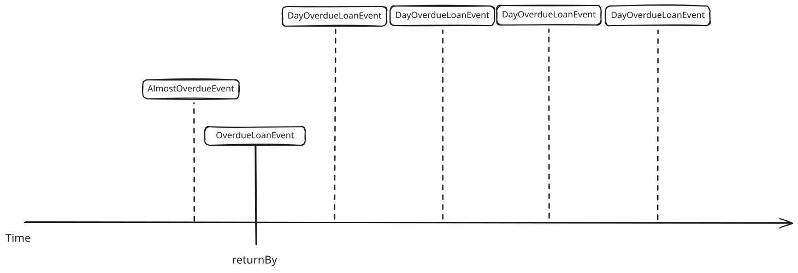
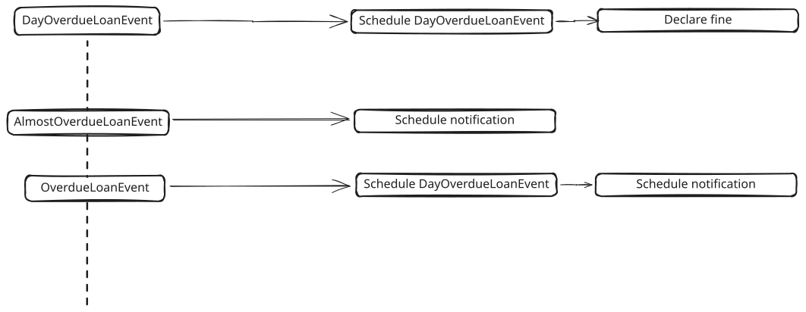

# Belangrijke Design keuzes
## Entiteiten
Onze entiteiten hebben bewust geen domeinlogica. Wij behoren domeinlogica de verantwoordelijkheid van de _service_ laag.
Het enige gedrag op entiteiten zijn _getters_ en _setters_.

Data en gedrag is dus apart. Dit zorgt voor een grote flexibiliteit doordat de gegevens in verschillende contexten, met 
verschillend gedrag, kunnen worden gebruikt. Nadeel is dat duplicatie van code makkelijker ontstaat. Daar moet dus opgelet
worden.

## Inplanning van taken
Taken binnen ons systeem hebben vaak een tijdsgebonden natuur. Enkele voorbeelden:
- Sturen van een notificatie, na of voor een bepaalde gebeurtenis.
- Declareren van boetes, na een bepaalde gebeurtenis.

In het systeem draagt één module deze tijdsgebonden vereisten op zich, namelijk de _scheduling_ module. Een aparte 
module voor deze functionaliteit helpt ons op de volgende vlakken:
- **Voorkomt duplicatie** van code.
- **Hoge cohesie**, en daarmee **één doel**. **Volgt _single responsibility_ principe**

De module is zo gebouwd dat dit ook de andere letters van de _SOLID_ principes handhaaft, namelijk:
- **Open/Closed principe**:. Andere modules binnen het systeem zoals _events_ en _notifications_ breiden uit op de 
functionaliteit. Zonder een grote requirements verandering op de horizon kan ik met zekerheid zeggen dat de openbare API
van de code niet snel zou hoeven te veranderen.
- **Liskov's Substitution Principle**: De _classes_ uit andere modules implementeren en of breiden uit op de structuur. Daarmee
kunnen de afgeleide _classes_ gebruikt worden als de basis _classes_.
- **Interface Segregation Principle**: 
  - Interfaces zijn gedefinieerd met één doel.
  - Interfaces worden alleen geïmplementeerd als deze een daadwerkelijke implementatie gaat krijgen, geen stubs.
- **Dependency Inversion**: Klassen binnen de module zijn afhankelijk van definities zo laag mogelijk in de hiërarchie. 
In de praktijk betekent dit dat _classes_ afhankelijk zijn van abstracties, niet van concrete implementaties.
Zo ontstaat er geen artificiële koppeling.

## Centralisatie van _events_
Zoals eerder besproken zijn er meerdere requirements die tijdsgebonden zijn. Deze momenten hebben vaak overlap tussen
de verschillende requirements. Denk bijv. aan een situatie waarbij het leentermijn van een product is verlopen, en dus
het product _te laat_ is. Zowel notificaties en boetes zitten gekoppeld aan dit moment.

Hieruit bleek dat er vraag is naar een aparte module voor het kunnen definiëren van deze momenten; _events_. 

Ook de _events_ structuur is in elkaar gezet met _SOLID_ in het achterhoofd.

De volgende events, gebaseerd op leningen, zijn voor nu bedacht:

De events zorgen momenteel voor de volgende acties:

